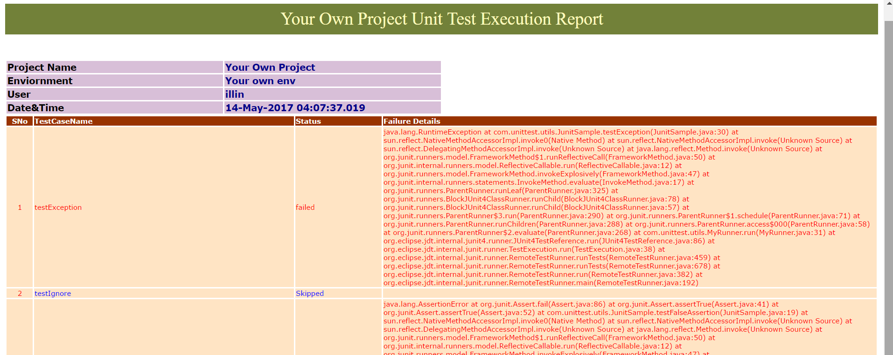

## JUnit Execution Report

##### Introduction:
Welcome to JUnit Test Execution Report Repo. We all know that JUnit doesn't provide any reporting. Most of us doesn't know that JUnit has the listener implementation. This is a sample project to tell you how to generate a light weight and useful report for JUnit framework Projects. This report is built on simple html with Java. 

### How it works:
* The execution starts with JunitSample class. This class uses MyRunner class as runner.
* Myrunner class extends BlockJUnit4ClassRunner. This class registers your listener class which is JUnitExecutionListener.
* JUnitExecutionListener class extends RunListener which holds all the listener methods. We override those methods and write our own implementation. This class uses HTMLReport class which has all HTML report util methods.
* The HTMLReport.java class uses java builder and html tags to construct the report dynamically.
* The Report would be generated under junit folder. It overrides the existing report for every run.

### Sample Report:

### Support
For support please contact me: illi.nainappa@gmail.com.
